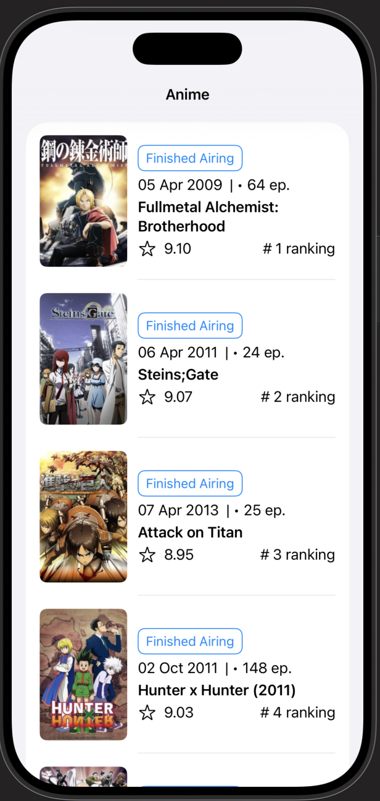
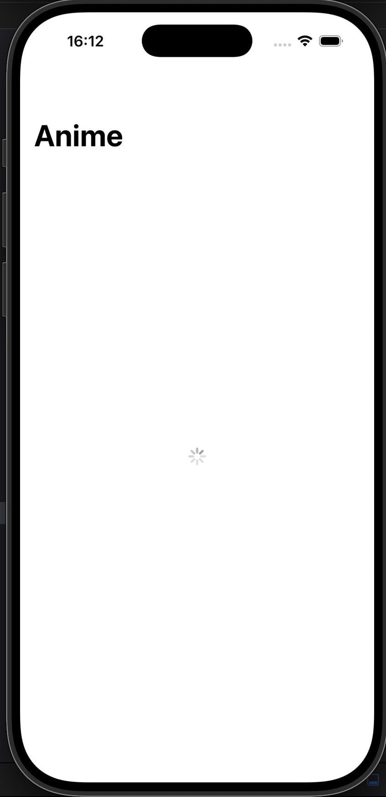
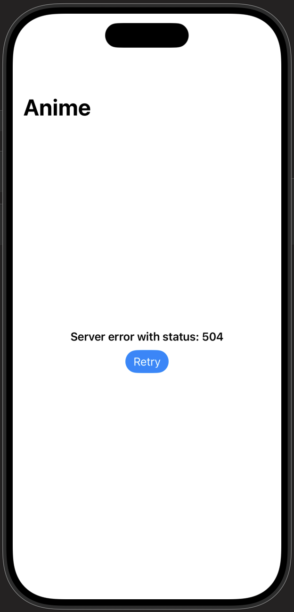

# TopAnime

A native SwiftUI app that lists top-ranked TV anime via the [Jikan API](https://docs.api.jikan.moe/) (an unofficial MyAnimeList API), with an explicit screen-state model and a fully protocol-based, testable networking layer.

  
  
  

## Features

- Lists top-ranked anime: title, poster, airing status, score, episode count, and rank
- Explicit screen states — loading, content, empty, and error — modeled as a single `enum`, not a set of separate flags
- Graceful error handling with a Retry action for transient network failures
- No API key required — Jikan is a free, public API

## Architecture

MVVM, with the networking layer built around a protocol rather than a concrete type:

- **`AnimeServiceProtocol`** — the contract the ViewModel actually depends on, not a concrete class. Any mock conforming to this protocol can be swapped in for tests.
- **`AnimeService`** — the real implementation: builds the request, validates the HTTP response, decodes JSON into `Anime` models. `URLSession` is injected through the initializer (defaults to `.shared`), so it can be replaced with a mock session in tests too.
- **`AnimeViewModel`** — owns a single `State` enum (`loading` / `content` / `empty` / `error(String)`) instead of separate `isLoading`/`errorMessage` flags, which makes invalid state combinations (e.g. loading *and* showing an error at once) structurally impossible.

## Tech stack

Swift · SwiftUI · `@Observable` / `@Bindable` · MVVM · Protocol-oriented networking · Async/await · URLSession · Codable · SwiftLint

## Setup

No API key needed.

1. Clone the repo.
2. Open `TopAnime.xcodeproj` in Xcode.
3. Run on any simulator or device.

## Author

Maksym Yakymchuk — [GitHub](https://github.com/yakymchukwork9030-dev) · yakymchukwork9030@gmail.com
